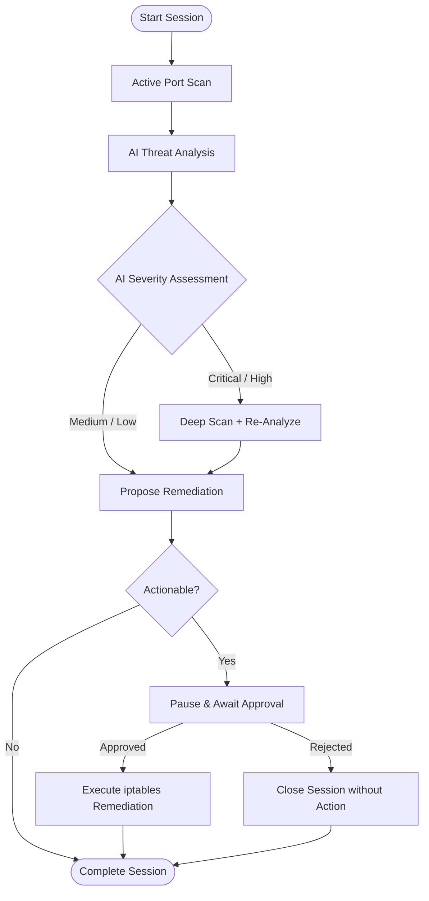

# Project NetAgent

Project NetAgent is an AI-powered network security dashboard (functioning as a "SOC Analyst in a Box") that enables active vulnerability scanning, passive network traffic analysis, live packet capture, and automated threat explanation using local, air-gapped Large Language Models (LLMs).

---

## 1. Project Overview

Project NetAgent integrates several modules into a unified security dashboard:
1. **Active Scan Module**: Uses socket-based scanning to discover open ports, services, banners, and vulnerabilities on target hosts/networks.
2. **Passive Analysis Module**: Uses Scapy to sniff live packets or parse uploaded PCAP/PCAPNG files, flagging anomalies such as port scans, DDoS, and signature-based threats.
3. **AI Threat Explainer**: Communicates with a local, air-gapped Ollama instance to analyze scans or alerts, providing detailed explanations, severity assessments, and remediation steps.
4. **AI Security Copilot Chatbot**: An interactive, multi-turn conversational interface that helps security administrators query host security, troubleshoot vulnerabilities, and plan mitigations.
5. **Semi-Autonomous Agent Engine**: A multi-step threat investigator that chains scanner results and AI-based threat analysis to determine if deep scans are required, proposes precise host-level remediation commands (iptables rules), and waits for human operator approval before execution.
6. **React Frontend (Vite)**: An interactive web dashboard displaying real-time traffic charts, active alerts feed, active scanner controller, conversational chatbot panels, and the Semi-Autonomous Agent interface.

---

## 2. Prerequisites

To build and run NetAgent, ensure the following are installed on your host system:
- **Docker** (v20.10.0 or later)
- **Docker Compose** (v2.0.0 or later)
- **Ollama** (for AI Threat Explainer functionality)
- **Linux Kernel** supporting raw sockets and network capabilities (`NET_ADMIN` and `NET_RAW` are required for containerized packet capture).

---

## 3. Installation & Setup

You can start the entire application suite using the following sequence of commands:

1. **Pull the required AI model on your host:**
   ```bash
   ollama pull llama2
   ```

2. **Build and launch the containerized application:**
   ```bash
   docker compose up --build -d
   ```

3. **Verify the services are running:**
   ```bash
   docker compose ps
   ```

4. **Access the application:**
   - Open your web browser and navigate to `http://localhost` (Nginx Frontend)
   - The API documentation and backend endpoints are available at `http://localhost:8000`

---

## 4. Configuration Guide

### Ollama Model Setup
The AI Threat Explainer communicates with Ollama via REST API. 
- In `docker-compose.yml`, the backend specifies `OLLAMA_BASE_URL=http://host.docker.internal:11434` to communicate with the host's Ollama instance.
- You can configure the backend behavior by editing the environment variables in `docker-compose.yml`:
  - `OLLAMA_BASE_URL`: Base URL of your Ollama service (defaults to host gateway).
  - `OLLAMA_MODEL`: The LLM to target (defaults to `llama2`. You can use `llama3`, `mistral`, or any other model pulled via `ollama pull`).
  - `OLLAMA_TIMEOUT`: Network request timeout in seconds (default: `10.0`).

### Network Permissions
Passive live packet sniffing requires access to low-level socket APIs.
- The `backend` container is configured with:
  ```yaml
  cap_add:
    - NET_ADMIN
    - NET_RAW
  ```
- **NET_RAW** allows Scapy to open raw sockets for packet sniffing.
- **NET_ADMIN** allows the container to configure network interfaces and routing table policies.
- Ensure your host kernel and container runtime do not block these capabilities (enabled by default on Linux).

---

## 5. Usage Guide

### Active Scanning
1. Navigate to the **Scanner** page from the sidebar.
2. Enter a target IP address, subnet range (e.g., `192.168.1.0/24`), or domain name.
3. Choose a scanning profile:
   - **Quick Scan**: Scans standard/common ports.
   - **Full Scan**: Scans a wider port range.
   - **Targeted Scan**: Scans specifically configured ports.
4. Click **Start Scan**. The scan runs as a background task. Results are displayed in the scan history list showing open ports, services, and potential vulnerabilities.

### PCAP File Upload
1. Navigate to the **Traffic** page.
2. Drag and drop or click to select a `.pcap` or `.pcapng` file.
3. NetAgent will parse the file, execute heuristic threat rules (DDoS and Port Scan detection), record alerts in the SQLite database, and refresh the UI alert feed.

### Live Capture
1. Go to the **Traffic** page and locate the **Live Capture** card.
2. Select a target interface (`eth0`, `wlan0`, or `lo`).
3. Click **Start Capture**. NetAgent will snort/sniff live packets, raising real-time alerts if anomalous traffic patterns occur.
4. Click **Stop Capture** to terminate the session.

### AI Explainer
1. Click on any active alert in the feed or scan history entry.
2. Click **Explain Threat**.
3. NetAgent queries Ollama to generate a JSON response with a clear threat explanation, custom severity rating, and remediation checklists.
4. *Air-Gap Fallback*: If Ollama is offline or slow, the system automatically falls back to an offline rule-based mock explainer so operations are uninterrupted.

### AI Security Copilot Chat
1. Go to the **🤖 AI Copilot** tab in the main navigation.
2. Type any cybersecurity question, port query, or mitigation troubleshooting request (e.g., *"How can I secure SSH port 22?"*).
3. The chatbot retains conversation history and queries the local Ollama instance for conversational, step-by-step guidance.
4. *Fallback Mode*: If Ollama is offline, the chatbot enters *Offline Fallback Mode*, offering interactive pre-configured advice for critical services (SSH, Database, Active Scanner).

### Semi-Autonomous Agent
1. Go to the **🤖 Autonomous Agent** tab.
2. Enter a target network IP/subnet (e.g., `192.168.1.15`) and select a scan profile.
3. Click **Start Investigation** to launch the autonomous threat hunting loop:
   * **Phase 1**: Initiates the session and logs the target.
   * **Phase 2**: Triggers an active port scan.
   * **Phase 3**: Analyzes scan results with local LLM.
   * **Phase 4**: If severity is Critical/High, escalates to a deep scan; otherwise proceeds.
   * **Phase 5**: Generates actionable remediation commands (such as `iptables` drop rules) and enters `AWAITING APPROVAL`.
4. Review the proposed action cards. Click **Approve & Execute** to apply the rules (simulated shell output) or **Reject** to close the session safely.


---

## 6. API Documentation

### Active Scans

#### `POST /api/scans`
- **Purpose**: Triggers a new network scan in the background.
- **Request Body**:
  ```json
  {
    "target": "192.168.1.1",
    "profile": "quick"
  }
  ```
- **Response** (201 Created):
  ```json
  {
    "id": 1,
    "target": "192.168.1.1",
    "profile": "quick",
    "status": "running",
    "created_at": "2026-06-10T08:37:00Z"
  }
  ```

#### `GET /api/scans`
- **Purpose**: Retrieves a chronological list of scan history summaries.
- **Response** (200 OK): Array of scan objects.

#### `GET /api/scans/{id}`
- **Purpose**: Retrieves details of a specific scan including the list of open ports, banners, and found vulnerabilities.
- **Response** (200 OK): Detailed scan history and results.

---

### Passive Alerts & Live Capture

#### `GET /api/alerts`
- **Purpose**: Retrieves security alerts stored in the database.
- **Query Parameters**:
  - `limit`: (Optional) Maximum number of alerts to retrieve.
  - `severity`: (Optional) Filter by severity (`low`, `medium`, `high`, `critical`).
- **Response** (200 OK): List of generated alerts.

#### `POST /api/alerts/capture`
- **Purpose**: Controls the live packet capture sniffer thread.
- **Request Body**:
  ```json
  {
    "action": "start",
    "interface": "eth0"
  }
  ```
- **Response** (200 OK):
  ```json
  {
    "status": "capturing",
    "interface": "eth0"
  }
  ```

#### `POST /api/alerts/analyze-pcap`
- **Purpose**: Uploads and parses a PCAP/PCAPNG capture file for anomalies.
- **Request Header**: `Content-Type: multipart/form-data`
- **Request Body**: Binary file uploaded under the form key `file`.
- **Response** (200 OK):
  ```json
  {
    "status": "success",
    "filename": "traffic.pcap",
    "alerts_generated": 2,
    "alerts": [...]
  }
  ```

---

### AI Threat Explainer

#### `POST /api/explain`
- **Purpose**: Requests AI-generated description, severity analysis, and remediation steps.
- **Request Body**:
  ```json
  {
    "source_type": "alert",
    "source_id": 1
  }
  ```
- **Response** (200 OK):
  ```json
  {
    "explanation": "A SYN scan attack was detected. The source host initiated multiple rapid half-open TCP requests...",
    "severity": "medium",
    "remediation": "Configure firewall rules to rate-limit incoming TCP SYN packets, block the source IP address..."
  }
  ```

#### `POST /api/chat`
- **Purpose**: Conversational chat interface with AI Copilot.
- **Request Body**:
  ```json
  {
    "message": "Explain port 22 security",
    "history": [
      {"role": "user", "content": "Hello"},
      {"role": "assistant", "content": "Hello! How can I assist you with network security today?"}
    ]
  }
  ```
- **Response** (200 OK):
  ```json
  {
    "response": "Port 22 hosts the SSH service, which is used for secure remote management..."
  }
  ```

---

### Semi-Autonomous Agent Engine

#### `POST /api/agent/sessions`
- **Purpose**: Starts a new semi-autonomous investigation session on a target.
- **Request Body**:
  ```json
  {
    "target": "192.168.1.15",
    "profile": "quick"
  }
  ```
- **Response** (201 Created):
  ```json
  {
    "id": 1,
    "target": "192.168.1.15",
    "profile": "quick",
    "status": "running",
    "created_at": "2026-06-16T04:20:00Z",
    "steps": []
  }
  ```

#### `GET /api/agent/sessions`
- **Purpose**: Lists all investigation sessions and their status.
- **Response** (200 OK): Array of session objects containing active steps.

#### `POST /api/agent/sessions/{session_id}/approve/{step_id}`
- **Purpose**: Approve and execute the proposed remediation actions.
- **Response** (200 OK):
  ```json
  {
    "success": true,
    "message": "Actions approved. Executing remediation..."
  }
  ```

---

### Autonomous Agent Flowchart



